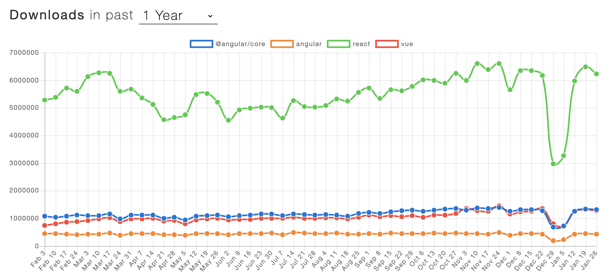
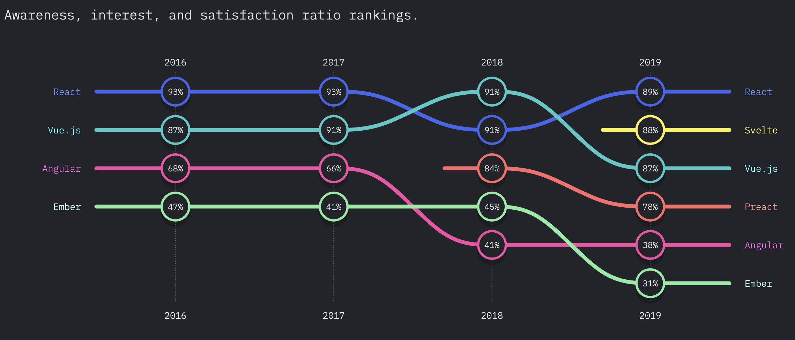
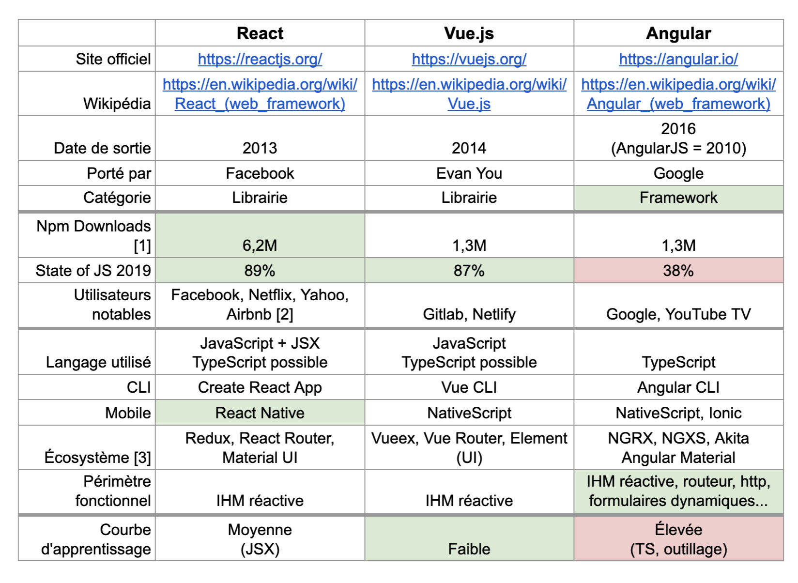

# 📚 Formation React vs. Vue vs. Angular

## 🗒 Objectif des 3 jours qui viennent

- *Découverte* des 3 principaux frameworks JS : React, Vue et Angular.
- *Comprendre* leurs principales fonctionnalités et leur "philosophie", pas devenir expert.
- Être capable de *comparer* les 3 pour décider lequel utiliser.

### 🎬 WOOCLAP: Avez-vous déjà utilisé React, Vue ou Angular ?

Rendez-vous sur https://www.wooclap.com/.

## 🗒 Nombre de téléchargements Npm

Source : https://www.npmtrends.com/@angular/core-vs-angular-vs-react-vs-vue

Pourquoi faut-il relativiser ces chiffres ?

## 🗒 The State of JavaScript 2019

Source : https://2019.stateofjs.com/front-end-frameworks/

Pourquoi faut-il relativiser ces chiffres ?

## 🗒 Tableau de comparaison

