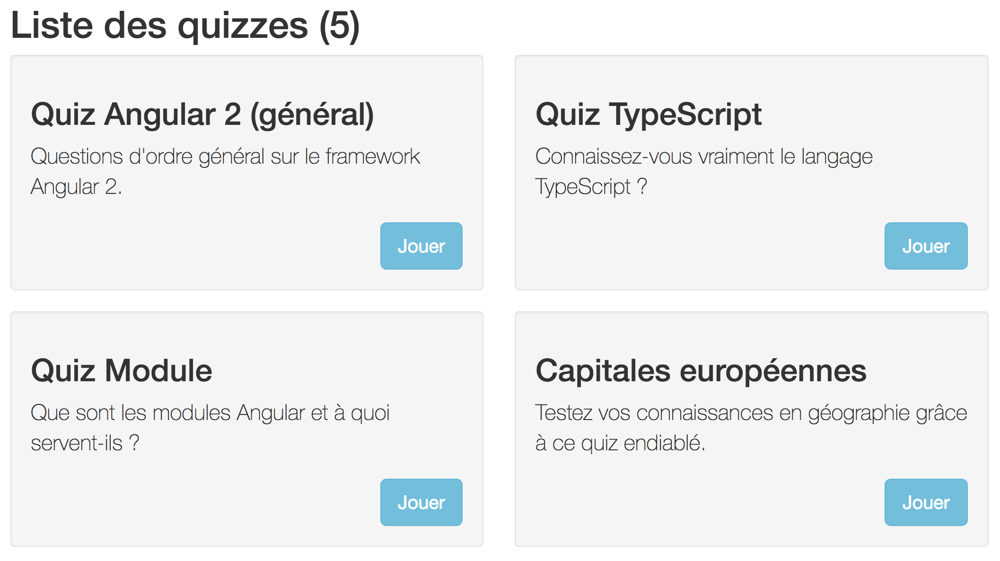
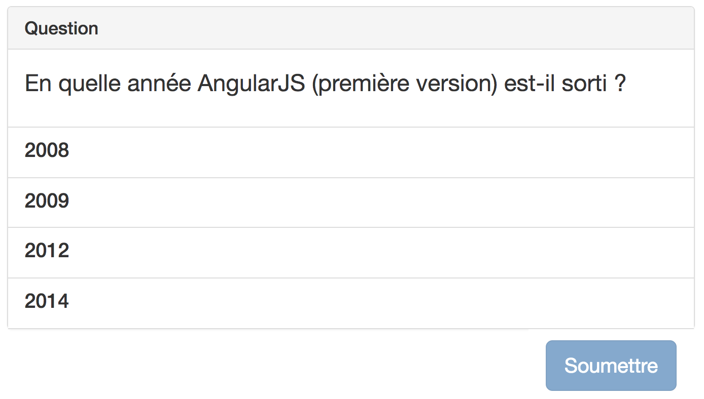

# Formation Angular 5.x - Exercices


## AVANT DE DÉMARRER LES EXERCICES


### Logiciels

Les logiciels suivants doivent être installés sur votre machine :

- [Node.js](https://nodejs.org/) et npm (au minimum node v6.9.x et npm 3.x).
- IDE qui supporte TypeScript, par exemple [Visual Studio Code](https://code.visualstudio.com/) (ou équivalent).
- Navigateur web moderne, par exemple Google Chrome.


### Angular CLI et fichiers

Installer [Angular CLI](https://github.com/angular/angular-cli) globalement sur votre machine :

```bash
npm install -g @angular/cli
```

Téléchargez les fichiers suivants depuis Github :

- Le support de cours en PDF.
- Les fichiers pour faire les exercices.


## EXO 0 : Votre première appli Angular

OBJECTIF : Vérifier que le stack technique fonctionne et personnaliser l'application standard générée par le CLI.

### Créer une appli Angular CLI standard

```bash
ng new superquiz
cd superquiz
```

Ensuite, lancez la compilation et le serveur de développement avec cette commande :

```bash
ng serve
```

Ouvrez votre navigateur à l'adresse http://localhost:4200/. Voyez-vous la page d'accueil Angular CLI ?

Ouvrez le répertoire de l'application dans votre IDE. Si vous modifiez la propriété `appName` située dans `src/app/app.component.ts` puis enregistrez, voyez-vous le texte modifié apparaître automatiquement dans votre navigateur ?

### Personnaliser l'appli Angular CLI

1) Dans le répertoire `superquiz`, remplacez le répertoire `src` par le répertoire `src` fourni dans [superquiz-starter.zip](superquiz-starter.zip).

2) Installez [Bootstrap CSS](http://getbootstrap.com/) :

```bash
npm install bootstrap@3 --save
```

Chargez la CSS de Bootstrap en ajoutant cette ligne dans le fichier `.angular.json` à la racine du projet :

```json
"styles": [
  "node_modules/bootstrap/dist/css/bootstrap.css",   // <!-- ajouter ça
  "styles.css"
],
```


## EXO 1 : Comprendre le modèle de données

OBJECTIF : Comprendre les choix d'implémentation pour la classe `Quiz` et les reproduire dans une classe `User`.

### DISCUTONS ENSEMBLE : Comprendre la classe `Quiz`

La classe `Quiz` permet de modéliser et manipuler les quizzes dans notre application.

**TOUS ENSEMBLE :** Regardez le code de la classe `Quiz` dans `models/quiz.ts`. Comment feriez-vous pour créer une **instance de quiz** avec le titre "Mon premier quiz" ?

**TOUS ENSEMBLE :** Quel est l'intérêt de passer un seul paramètre au constructeur de Quiz (`options`) plutôt qu'un paramètre par propriété ?

### Créer une classe `User`

Dans le fichier `models/user.ts`, créez une classe `User` qui permettra de manipuler les utilisateurs de l'application.

Propriétés de la classe `User` :

- `name`, obligatoire
- `email`, obligatoire
- `photo`, facultative, valant chaîne vide par défaut
- `active`, facultative, valant `true` par défaut

Comme dans la classe `Quiz`, chaque propriété pourra être initialisée via un objet unique passé au constructeur de la classe `User`.


## EXO 2 : Vos premiers composants

OBJECTIF : Refactoriser la page de notre application en petits composants.

### Paramétrer le CLI

Par défaut, la commande `ng generate component` du CLI génère un fichier `.css` et un fichier de test `.spec.ts` pour chaque nouveau composant.

Nous n'allons pas utiliser ces fichiers pendant la formation, on peut donc paramétrer le CLI pour qu'il ne les génère pas (idem pour les directives, les services, etc.).

Exécutez le code suivant pour modifier le paramétrage du CLI dans le fichier `angular.json` :

```cmd
ng config schematics.@schematics/angular:component.spec false
ng config schematics.@schematics/angular:component. inlineStyle true
ng config schematics.@schematics/angular:service.spec false
ng config schematics.@schematics/angular:guard.spec false
ng config schematics.@schematics/angular:directive.spec false
```

### Refactoriser la structure générale de page

Toutes les pages de notre application seront organisées en 3 blocs :

1. Barre de navigation
2. Contenu (contient la page d'accueil, pour l'instant)
3. Pied de page

Pour l'instant, ces 3 blocs sont affichés dans l'unique composant de notre application, `AppComponent`, ce qui entraîne un HTML assez dense.

Refactorisez l'affichage de sorte que chaque bloc soit affiché via son propre composant, c'est à dire :

1. `NavbarComponent`
2. `HomeComponent`
3. `FooterComponent`


## EXO 3 : Utiliser l'interpolation et le binding de propriété

OBJECTIF : Utiliser l'interpolation et le binding de propriété pour afficher des données dynamiquement.

Rendez dynamiques les éléments d'interface suivants :

- NAVBAR: Logo "SuperQuiz" - Doit venir d'une propriété `logo`
- NAVBAR: Utilisateur "Bob l'éponge" - Doit venir d'une propriété `user.name`, la variable `user` contenant une instance de la classe `User` créée précédemment.
- FOOTER: Date du copyright - Doit venir d'une propriété `copyrightDate = (new Date()).getFullYear()`


## EXO 4 : Utiliser les directives structurelles et le binding d'événement

OBJECTIF : Afficher la barre de nav et la liste des quizzes dynamiquement.

### Rendre le menu de navigation dynamique

Dans `NavbarComponent`, sortez les éléments de la nav (Accueil, Quizzes...) dans une propriété `navItems` et affichez-les dans le template grâce à une boucle `*ngFor`.

### Créer l'écran "Liste des quizzes" (`QuizListComponent`)



1) Créez un composant `QuizListComponent` avec Angular CLI, et affichez-le dans le template de `AppComponent`, à la place de `HomeComponent`.

2) Copiez le HTML ci-dessous dans le template du composant.

3) Rendez le template dynamique en y affichant les quizzes stockés dans la variable `QUIZZES` (il suffit d'importer cette variable dans votre composant depuis le fichier `data/quizzes.ts`). N'oubliez pas de dynamiser la variable `NOMBRE_TOTAL_DE_QUIZZES`.

```html
<h1>Liste des quizzes (NOMBRE_TOTAL_DE_QUIZZES)</h1>

<div class="row">

  <!-- Premier quiz -->
  <div class="col-sm-6">
    <div class="well">
      <h2>QUIZ_TITLE</h2>
      <p class="lead">QUIZ_DESCRIPTION</p>
      <div class="text-right">
        <a href="" class="btn btn-info btn-lg">Jouer</a>
      </div>
    </div>
  </div>

  <!-- Deuxième quiz... -->
  <div class="col-sm-6">
    ...
  </div>

</div>
```

### Comprendre le côté "live" des bindings

Grâce à la détection de changement, si les valeurs bindées changent, le template est rafraîchi automatiquement, SANS RECHARGEMENT DE PAGE.

1) Pour illustrer ce fonctionnement, affichez deux boutons au-dessus la liste grâce au HTML fourni plus bas :

- Bouton "Ajouter" - Quand cliqué, doit ajouter un quiz bidon à la fin de la liste
- Bouton "Supprimer" - Quand cliqué, doit supprimer le dernier quiz de la liste

```html
<p>
  <button class="btn btn-default">Ajouter</button>
  <button class="btn btn-default">Supprimer</button>
</p>
```

La liste et le total doivent se rafraîchir automatiquement quand on clique les boutons.

2) Si le nombre de quiz est à zéro, affichez un message "Aucun quiz à afficher".

3) Pourquoi les quizzes sont réinitialisés quand on rafraîchit la page ?


## EXO 5 : Créer l'écran "Question d'un quiz" (`QuizQuestionComponent`)

OBJECTIF : Créer l'écran qui affiche une question précise d'un quiz avec la liste des réponses possibles :



**1) Affichez le composant**

Affichez le composant `QuizQuestionComponent` (**déjà créé**) dans le template de `AppComponent` afin de visualiser vos modifs.

Dans ce template, vous pouvez supprimer la balise `<app-quiz-list></app-quiz-list>` correspondant à l'exercice précédent.

**2) Dynamisez le template**

Dans le template, ajoutez les bindings adéquats pour afficher la question en cours et ses différents choix (propriété `question` de la classe).

Affichez le texte "Plusieurs réponses possibles" uniquement si la propriété `question.multipleChoicesAllowed` vaut `true`.

**3) Pouvoir sélectionner une ou plusieurs réponses**

Permettez à utilisateur de sélectionner un choix ou plusieurs choix :

- Cliquer sur un choix non sélectionné le sélectionne.
- Cliquer sur un choix déjà sélectionné le dé-sélectionne.

Implémentation :

- Quand un choix est cliqué, appelez une méthode `clickChoice(choice)` qui permet de sélectionner ou dé-sélectionner le choix passé en paramètre.
- Si un choix est sélectionné, ajoutez la classe CSS `active` à la balise `<a>` qui l'encadre de manière à l'afficher en surbrillance.

**4) Afficher si correct ou incorrect**

Au clic sur "Soumettre" :

- Changez le libellé et la couleur du bouton "Soumettre" en fonction de la réponse :
  - Libellé "CORRECT" + couleur verte (classe `btn-success`) si la réponse est correcte,
  - Libellé "INCORRECT" + couleur rouge (class `btn-danger`) si la réponse est incorrecte.
- Si la réponse est incorrecte, affichez le message "La bonne réponse était : `TEXTE_DE_LA_BONNE_REPONSE`".  
 Méthodes utiles : `question.getCorrectChoices()` renvoie une string contenant la ou les bonnes réponses ; `question.explanation` contient des précisions sur la bonne réponse.

**5) Résoudre les problèmes d'ergonomie et d'affichage**

- Trouvez un moyen de **désactiver le bouton "Soumettre"** tant que l'utilisateur n'a pas répondu, c. à d. n'a sélectionné aucun choix. Remarque : `answer.isAnswered()` permet de savoir si une réponse a au moins un choix sélectionné.
- Trouvez un moyen **d'empêcher l'utilisateur de changer sa réponse** et de recliquer sur "Soumettre" après avoir cliqué "Soumettre" une première fois.
- Gérez le **scénario "question déjà répondue"** (par ex si l'utilisateur revient sur une question précédente). Pour simuler ce cas de figure, initialisez la propriété `answer` avec une réponse non vierge, et vérifiez que tout s'affiche correctement. Si pas, corrigez les problèmes.
- Gérez le **scénario "question suivante"**. Ajoutez un bouton qui appelle la méthode temporaire `gotoNextQuestionTEMP()` pour charger une nouvelle question/réponse. Quel est le problème quand on charge une nouvelle question/réponse ? Comment le résoudre ?


## EXO 6 : Refactoriser la liste des quizzes

Refactorisez la liste des quizzes (`QuizListComponent`) de sorte que :

- Chaque quiz de la liste soit affiché par son propre composant `QuizItemComponent`.
- Le quiz à afficher soit transmis de `QuizListComponent` à `QuizItemComponent` via un `@Input`.


## EXO 7 : Préparer la navigation dans un quiz

OBJECTIF: Refactoriser l'affichage en prévision de pouvoir démarrer un quiz, puis naviguer d'une question à l'autre avec des boutons Précédent/Suivant.

**1) Créer le parent "Quiz Player"**

Créez un composant `QuizPlayerComponent` avec le CLI.

Copiez le HTML suivant dans le template du composant. Il représente la structure générale du player :

```html
<h2>QUIZ_TITLE</h2>
<p>QUIZ_DESCRIPTION</p>

<p><button class="btn btn-info btn-lg">
  Démarrer le quiz
</button></p>

<p>
  NAVIGATION PRÉCÉDENT // SUIVANT
</p>

<p>
  QUIZ_QUESTION
</p>
```

⚠️ N'oubliez pas d'afficher ce composant dans le template de `AppComponent` pour voir ce que vous faites.

**2) Refactoriser l'enfant `QuizQuestionComponent`**

- Transformez les propriétés `question` et `answer` de `QuizQuestionComponent` en **inputs**. ATTENTION, cela signifie qu'il ne faut plus leur affecter de valeur initiale.
- Créez un **output** appelé `submit` qui émet au parent la "réponse à la question" au clic sur le bouton "Soumettre".

**3) Dynamiser le template du parent**

Dans le composant parent `QuizPlayerComponent` :

- Initialisez les propriétés nécessaires à l'affichage d'un quiz entier :

```typescript
currentQuiz = QUIZZES[0];
currentQuestion = QUIZZES[0].questions[0];
currentAnswer = new Answer({ questionId: this.currentQuestion.id, multipleChoicesAllowed: false });
currentAnswers: AnswersState = {};
```

- Remplacez les différents emplacements du template par les valeurs appropriées :
  - Remplacez `QUIZ_TITLE` et `QUIZ_DESCRIPTION` par leurs valeurs réelles.
  - Remplacez `NAVIGATION...` par le composant `QuizNavComponent` (déjà codé pour vous).
  - Remplacez `QUIZ_QUESTION` par le composant `QuizQuestionComponent` (codé ensemble).  
  ⚠️ N'oubliez pas de passer les bons inputs aux composants enfants pour que tout s'affiche correctement !

**4) Fonctionnalité "passer à la question suivante"**

Trouvez une solution pour qu'un clic sur le bouton "Suivant" (dans la nav) affiche la question suivante du quiz (dans le composant Question).

RÉFLÉCHISSONS ENSEMBLE : Quelles sont les limites de s'en tenir à une implémentation naïve ?

**5) Fonctionnalité "Démarrer le quiz"**

Pour terminer, faites en sorte que :

- On voie uniquement le titre du quiz et le bouton "Démarrer" à l'affichage initial du player.
- Un clic sur "Démarrer" fait disparaître ce bouton et affiche la première question.


## EXO 8 : Créer un service d'accès aux données (`QuizService`)


### Créer le service

Créez un service `QuizService` et déclarez-le dans les providers adéquats.

Implémentez les méthodes suivantes dans le service :

- `loadQuizzes(): Quiz[] { ... }` - Retourne la liste de tous les quizzes.
- `loadQuiz(quizId: number): Quiz { ... }` - Retourne un quiz complet, avec ses questions.

⚠️ Pour le moment, ces méthodes renverront les données en dur qu'on trouve dans le fichier `data/quizzes.ts`.

### Utiliser le service

Utilisez le service aux endroits suivants :

- Pour charger la liste des quizzes dans `QuizListComponent`.
- Pour charger un quiz précis dans `QuizPlayerComponent` (à terme, l'id du quiz à charger viendra de l'URL).


## EXO 9 : Afficher un quiz entier, c. à d. toutes les questions (`QuizStateManager`)


### Relier le quiz player au `QuizStateManager`

Le Quiz Player doit maintenant utiliser le service `QuizStateManager` (déjà codé pour vous) pour **gérer l'état de l'application**.

Dans `QuizPlayerComponent` :

1) Injectez le service `QuizStateManager` grâce à l'injection de dépendance.

2) À l'initialisation du player, initialisez toutes les propriétés de la classe à partir des observables renvoyés par le `QuizStateManager`. Par exemple :

```typescript
this.currentQuestion = quizStateManager.getCurrentQuestion();
```

3) Définissez un quiz courant avec `QuizStateManager.setQuiz()`.

*À terme, on récupérera l'id du quiz à afficher dans l'URL et on le chargera depuis la base de données.*

4) Reliez les actions du player aux méthodes appropriées du `QuizStateManager`.

Actions à relier :

- Démarrer le quiz
- Bouton Précédent
- Bouton Suivant
- Soumettre une réponse - Indice : enregistrer la réponse dans l'état avec `QuizStateManager.addAnswer()`


## EXO 10 : Créer un module dédié à l'affichage des quizzes

Pour l'instant, nous avons créé tous nos composants et services à la racine du projet et nous les avons associés au `AppModule`. Pas idéal...

Il est temps de créer un module dédié à l'affichage des quizzes : le `QuizModule`.

**1) Crée un module `QuizModule` avec le CLI**

**2) Refactoriser le code**

Refactorisez le code de manière que toutes les fonctionnalités de quiz soient inclues dans `QuizModule`.

Cela veut dire :

- Déplacez tous les fichiers/répertoires dont le nom commence par `quiz-xxx` à l'intérieur du répertoire `quiz`.
- Déplacez de `AppModule` vers `QuizModule` les composants dont le nom commence par `QuizXXX`.

**3) Activer le `QuizModule`**


## EXO 11 : Créer les routes de l'application


**1) Déclarez les routes suivantes dans `AppModule`**

- Chemin `home` qui pointe sur `HomeComponent`.
- Chemin `login` qui pointe sur `LoginComponent`.
- Chemin vide qui redirige vers chemin `home`.

**2) Déclarez les routes suivantes dans `QuizModule`**

- Chemin `quizzes` qui pointe sur `QuizListComponent`.
- Chemin `quiz/:quizId` qui pointe sur `QuizPlayerComponent`.

**3) Indiquez où les routes doivent s'afficher**

Placez la directive `<router-outlet>` dans le template de `AppComponent` :

```html
<div class="container">
  <router-outlet></router-outlet>
</div>
```

**4) Câblez les liens**

Dans la **barre de navigation** en haut de page (`NavbarComponent`), faites pointer les différents liens vers leurs routes respectives. (Le lien "Admin" reste inactif pour l'instant).

Dans la **liste des quizzes**, chaque quiz doit pointer vers le chemin `quiz/:quizId`.


## EXO 12 : Refactoriser le `QuizService` pour utiliser une API REST


Pour la formation, nous allons utiliser JSON Server (https://github.com/typicode/json-server) qui permet d'exposer un simple fichier `.json` à travers une API REST. De l'extérieur, il se comporte comme une véritable API REST.


**1) Installez JSON Server**

Installez le paquet npm :

```bash
npm install json-server --save-dev
```

Ajouter le "script" suivant dans le fichier `package.json` :

```json
{
  "scripts": {
    ...
    "api:start": "json-server --watch db.json --port 3004",
    ...
  }
}
```

L'alias "api:start" permet maintenant de lancer le JSON Server avec la commande suivante :

```bash
npm run api:start
```

Visitez http://localhost:3004/ pour valider que tout fonctionne et vous familiariser avec les URL du JSON Server.

⚠️ À partir de maintenant, vous devez laisser tourner le JSON Server en tâche de fond, exactement comme le `ng serve`.


**2) Utilisez l'API REST dans le `QuizService`**

Modifiez le `QuizService` pour qu'il fasse des requêtes HTTP sur l'API REST.

Vous implémenterez les méthodes suivantes :

- `loadQuizzes()`
  - Requête GET sur http://localhost:3004/quizzes
- `loadQuiz(quizId)`
  - Requête GET sur http://localhost:3004/quizzes/QUIZ_ID
- `saveQuiz(quiz)`
  - Si création d'un quiz : Requête POST sur http://localhost:3004/quizzes
  - Si modification d'un quiz existant : Requête PUT sur http://localhost:3004/quizzes/QUIZ_ID
- `deleteQuiz(quizId)`
  - Requête DELETE sur http://localhost:3004/quizzes/QUIZ_ID

⚠️ Le **type** retourné par chaque méthode doit TOUJOURS être un `Observable`.


**3) Modifiez le code qui utilise le `QuizService`**

Les données retournées par le `QuizService` sont maintenant des observables (asynchrones). Le code qui utilise ces données n'est donc plus adapté ; il doit s'abonner aux observables  (`subscribe`) pour récupérer les données :

- Adaptez le code qui récupère la liste des quizzes, dans `QuizListComponent`.
- Adaptez le code qui récupère un quiz précis, dans `QuizPlayerComponent`.
- Adaptez le code des templates correspondants. En effet, les templates pourraient planter s'ils essaient d'afficher des données pas encore chargées (car asynchrones).


## EXO 13 : Créer le formulaire de création/édition d’un quiz


### 1) Activer le module d'admin

Chargez le module `AdminModule` **déjà créé**, en utilisant la syntaxe du *lazy loading* :

```typescript
// Routes de l'application
{ path: 'admin', loadChildren: 'app/admin/admin.module#AdminModule' },
```

Câblez le lien "Admin" dans la barre de navigation du site.


<!--
### 2) Rendre le composant `AdminQuizListComponent` dynamique

- Dans `loadQuizzes()`, chargez la liste des quizzes grâce au `QuizService` créé précédemment.
- Dans le template, remplacez les données statiques par les vraies données.
- Dans `deleteQuiz()`, supprimez le quiz passé en argument en utilisant le `QuizService`.

Câblez les différents liens dans les écrans d'admin :

- Sur la liste des quizzes (`AdminQuizListComponent`) :
  - Les boutons "Nouveau Quiz" et "Éditer" doivent mener vers le formulaire créé à l'instant.
  - Le bouton "Voir" doit mener sur le quiz correspondant dans le front-office.
  - Le bouton "Supprimer" doit supprimer le quiz sélectionné **après confirmation** et rechargez la liste des quizzes.
  - Le bouton "Gérer les questions" doit mener sur le composant `QuestionsListComponent`.
- Sur le formulaire d'édition (`AdminQuizFormComponent`) : le lien "Annuler" doit ramener à la liste des quizzes.
-->


### 2) Angulariser le formulaire de création/édition de quiz

OBJECTIF: Transformer le formulaire HTML classique de `QuizFormComponent` (**composant déjà créé**) en formulaire Angular.

**Dans le template :**

- Ajoutez les syntaxes de formulaire réactif aux endroits appropriés.

**Dans la classe :**

- Créez le modèle du formulaire. Ce modèle doit correspondre aux champs du template.
  - Si l'URL contient un paramètre `quizId`, c'est qu'on édite un quiz existant. Chargez ce quiz avec `QuizService` et passez-le au modèle du formulaire.
  - Si l'URL ne contient pas de paramètre `quizId`, c'est qu'on crée un nouveau quiz. Le modèle de formulaire doit être initialisé à vide.
- Appelez une méthode `saveQuiz()` à la soumission du formulaire. Elle doit récupérer les valeurs du formulaire et les enregistrer grâce au `QuizService`. En cas de succès, redirigez l'utilisateur vers la liste des quizzes.


### 3) Afficher les erreurs de validation

Dans le template du formulaire, affichez les erreurs de validation à côté des champs aqéquats.

Voici le HTML de Bootstrap typique d'un champ en erreur :

```html
<div class="form-group has-error"><!-- Notez la classe .has-error -->
  <label>...</label>
  <input ...>
  <div class="help-block">
    Texte du message d'erreur
  </div>
</div>
```

<!--
### Optimiser l'affichage des champs

Dans le template du formulaire, on répète beaucoup de markup identique pour chaque champ.

Pour afficher un champ, au lieu d'écrire ça :

```html
<div class="form-group">
  <label class="control-label">Titre</label>
  <input type="text" class="form-control" placeholder="Titre">
</div>
```

On voudrait pouvoir écrire ça :

```html
<field label="Titre">
  <input type="text" class="form-control" placeholder="Titre">
</field>
```

Pour cela, créez un composant custom `FormFieldComponent` situé dans le répertoire `common` qui :

- Possède le selector `field`.
- Se charge d'afficher la `<div>` et le `<label>` qui encadrent chaque champ.
- Utilise la **projection** pour conserver la balise `<input>` correspondant au champ lui-même.

Ensuite, modifiez le template du formulaire pour afficher chaque champ avec la nouvelle balise `<field>`.
-->


## EXO 14 : Comprendre les Observables

Nous allons nous entraîner à manipuler un observable. Rendez-vous sur la page d'admin intitulée "Observables" pour voir à quoi notre observable ressemble.

L'écran affiche les valeurs émises par l'observable. L'exercice consiste à transformer ces valeurs grâce aux opérateurs RxJS.

Implémentez les transformations suivantes dans `admin/observables/observables.component.ts` :

- Multiplier chaque valeur par 10.
- Ne garder que les valeurs comprise *strictement* entre 0 et 40.
- Préfixer chaque valeur par la chaîne contenue dans la variable `ROOT_URL`. Vous obtenez une URL valide pour du style `http://jsonplaceholder.typicode.com/posts/4`.
- Transformer chaque URL en requête HTTP (on dit "projeter un observable dans un autre").
- Extraire les propriétés `.id` et `.title` de chaque objet JSON. Concaténer ces deux propriétés.
- Réduire l'ensemble des valeurs de l'observable à une valeur unique : un tableau de valeurs.


## EXO 15 : Protéger les routes de l’application et précharger les données (routeur avancé)


### 1) Protéger les pages de l'interface d'admin (`CanActivate`)

OBJECTIF : Empêcher les utilisateurs non authentifiés d'accéder aux pages du back-office.

Créez un service `AuthGuard` qui implémente l'interface `CanActivate`.

Dans la méthode `canActivate()` du service :

- Renvoyez un observable qui émet `true` si l'utilisateur est authentifié.
- Redirigez l'utilisateur vers la page de login s'il n'est pas authentifié.

Pour déterminer si l'utilisateur est authentifié, vous utiliserez `AuthService.isLoggedIn()`.

Appliquez ce garde à toutes les routes commençant par le chemin `/admin`.


### 2) Protéger les réponses de quiz non sauvegardées (`CanDeactivate`)

OBJECTIF : Empêcher l'utilisateur de quitter un quiz tant qu'il n'a pas enregistré ses réponses.

Créez un service `CanDeactivateQuiz` qui implémente l'interface `CanDeactivate`.

Si l'utilisateur tente de quitter la route `/quiz/:quizId` alors qu'il n'a pas encore enregistré ses réponses (`QuizStateManager.hasPendingChanges == true`), demandez-lui confirmation : "Vous avez des réponses en cours. Voulez-vous poursuivre et perdre vos réponses ?"

S'il accepte, votre garde doit renvoyer `true` (ce qui autorise la navigation), sinon votre garde doit renvoyer `false`.

⚠️ Pour que cela fonctionne, le `QuizStateManager` doit être un provider GLOBAL. En effet, les providers d'un module *lazy-loaded* sont scopés à ce module.


### 3) Précharger les quizzes (`Resolve`)

OBJECTIF : Charger le quiz en cours depuis le routeur, plutôt que dans le code du composant qui utilise le quiz.

BÉNÉFICE ? Éviter de répéter le code "chargement d'un quiz" dans tous les composants qui ont besoin de charger un quiz (le quiz player, le formulaire d'édition d'un quiz...).

Créez un service `QuizResolver` qui implémente l'interface `Resolve` (fichier `services/quiz-resolver.service.ts` déjà créé).

Dans la méthode `resolve` du service, renvoyez un observable qui wrappe le quiz dont l'id est trouvé dans l'URL.

Appliquez ce resolve à la route `":quizId"` du `QuizModule`, de manière à précharger le quiz en cours sous la clé `quiz`.

Dans le composant associé à cette route, récupérez le quiz préchargé grâce au resolve.


## EXO 16 : Formulaires avancés


### Répéter les choix du formulaire de question

Dans le formulaire permettant de créer/éditer une question (`QuestionFormComponent`), faites en sorte qu'il soit possible d'ajouter et de retirer des choix dynamiquement, grâce à la technique du "champ répété".


### Valider plusieurs champs à la fois avec un validateur custom

Dans le formulaire permettant de créer/éditer un quiz (`AdminQuizFormComponent`), ajoutez un validateur custom qui permet de cocher "sauter les questions" uniquement si l'accès du quiz est "public".

Vous afficherez l'erreur correspondante dans le template du formulaire.


## EXO 17 : Tests unitaires

**IMPORTANT.** Avant de vous lancer dans les tests, assurez-vous que vous n'avez pas de tests en échec dans les fichiers `.spec.ts` créé par Angular CLI. Si oui, supprimez ces fichiers.


### Votre premier test

Pour valider votre configuration de test, créez votre premier test dans le fichier `app/1st.spec.ts` avec le code suivant :

```typescript
describe('1st tests', () => {
  it('true is true', () => expect(true).toBe(true));
});
```

Exécutez ensuite la commande `ng test` dans le terminal, et assurez-vous que le test est exécuté avec succès (les résultats des tests sont affichés dans la console).


### Tester un composant simple

Nous allons tester le `HomeComponent`.

Vous placerez votre code dans le fichier `common/home.component.spec.ts` (déjà créé).

Dans le setup (`beforeEach`), récupérez une référence à l'élément DOM qui représente la balise `<h1>...</h1>` affichée dans le template du composant et stockez-la dans la variable `el`.

Créez les tests suivants :

- La balise `<h1>` doit contenir la propriété `appName` du composant.
- Si on change la valeur de la propriété `appName` (depuis le test), alors le contenu de la balise `<h1>` doit contenir la nouvelle valeur.

**ATTENTION.** N'oubliez pas de déclencher la détection de changement quand c'est approprié.


### Tester un composant qui utilise un service

Créez les tests suivants pour tester le `QuizListComponentSync` (liste des quizzes). Vous placerez votre code dans le fichier `quiz/quiz-list.component.sync.spec.ts` (déjà créé).

Dans cet exercice, on va tester la version **synchrone** du composant, `QuizListComponentSync`. Les tests asynchrones sont un peu plus complexes à écrire, mais très bien expliqués sur la [doc officielle](https://angular.io/docs/ts/latest/guide/testing.html).

Pour rappel, ce composant injecte le service `QuizServiceSync` et appelle sa méthode `loadQuizzes()` pour obtenir la liste des quizzes, qui sont alors affichés dans le template sous forme de liste à puces. L'objectif du test est de remplacer `QuizServiceSync` par un stub qui renvoie des quizzes en dur et de tester que l'affichage du composant est correct.

**Dans le setup (`beforeEach`) :**

- Le stub `QuizServiceStub` a déjà été créé pour vous. C'est un simple objet JavaScript avec une méthode `loadQuizzes()` qui renvoie deux quizzes en dur.
- Dans la configuration du module de test, faites pointer `QuizServiceSync` (le "vrai" service) sur le stub.
- Déclenchez la détection de changement.
- Récupérez l'instance de `QuizServiceSync` injectée dans le composant.
- Récupérez la liste des `<li>...</li>` dans le template.
- Récupérez la liste des routerLinks dans le template.

**Tests :**

- La méthode `loadQuizzes()` du service doit renvoyer 2 valeurs.
- La première valeur renvoyée par la méthode `loadQuizzes()` du service doit avoir une propriété `title` qui vaut "Quiz bidon #1".
- Le template du composant doit contenir deux `<li>...</li>`.
- Le template du composant doit contenir deux routerLinks.


## EXO 18 : Internationalisation

**IMPORTANT.** En préparant la formation, je n'ai pas réussi à faire fonctionner l'outil `ng-xi18n`. Vous utiliserez donc le fichier `locale/messages.fr.xlf` déjà généré pour stocker vos traductions.

1) Passez le texte du `HomeComponent` en anglais et marquez les chaînes à traduire avec `i18n` :

```html
<div class="jumbotron">
  <h1 i18n>{{ appName }}</h1>
  <p i18n>Welcome to SuperQuiz, a quiz app created with Angular 2.</p>
</div>
```

2) Ajoutez le code suivant dans `index.html`, **juste avant** `System.import('app')...` :

```html
<script>
  // Get the locale id somehow
  document.locale = 'fr';

  // Map to the text plugin
  System.config({
    map: {
      text: 'systemjs-text-plugin.js'
    }
  });
</script>
```

3) Modifiez le code du bootstrap dans `main.ts` :

```typescript
import { getTranslationProviders } from './i18n-providers';

getTranslationProviders().then(providers => {
  const options = { providers };
  platformBrowserDynamic().bootstrapModule(AppModule, options);
});
```

4) Adaptez les id des chaînes à traduire

Le problème d'avoir utilisé un fichier `messages.fr.xlf` déjà généré est que les id ne sont pas corrects (`<trans-unit id="???">`).

Il faut donc regarder dans la console du navigateur les messages d'erreur du type :

```bash
Translation unavailable for message id="14d28f660b993e4b1f4ce4c4847be5b1c2d9799b"
```

et reporter les ids cités dans votre fichier `messages.fr.xlf`.

5) Vérifiez que le texte de la page d'accueil de l'application s'affiche bien en français.


## EXO 19 : Démo Déploiement

Suivre les instructions données par le formateur.


<!--
## EXO 20 : Gérer les questions d'un quiz dans le back-office


### Présentation

Nous allons créer un écran permettant de gérer les questions associées à un quiz. Il devra offrir les fonctionnalités suivantes :

- Ajouter une nouvelle question, avec un nombre illimité de réponses.
- Modifier une question existante.
- Changer l'ordre des questions.

Pour minimiser la quantité de code, nous avons fait les choix d'implémentation suivants :

- Tous les changements apportés aux questions sont faits **côté client**. Ils ne sont persistés sur le serveur que lorsque l'utilisateur clique sur un gros bouton "Enregistrer".
- Le formulaire d'ajout/modification de question est affiché directement dans l'écran de gestion des questions. Il n'y a pas de navigation entre plusieurs pages.
- Sur le serveur, les questions associées à un quiz sont enregistrées sous forme d'un unique objet `QuestionsSet` contenant une liste de questions et l'id du quiz auquel elles se rattachent.

Notre code sera implémenté dans deux composants :

- `QuestionsListComponent` qui affiche la liste des questions d'un quiz, et permet de les ré-ordonner, ou de déclencher l'ajout/suppression/modification d'une question.
- `QuestionFormComponent` qui contient le formulaire permettant d'ajouter/modifier une question.


### Liste des questions

Commençons par la liste des questions dans `QuestionsListComponent` (`app/admin/questions-list.component.ts`).

Tâches préalables :

- Examinons ensemble les **propriétés de classe** qui vont nous permettre d'implémenter les comportement ci-dessus : `questionSet`, `questionInEdition`, `hasPendingChanges`, `isEditMode`.
- Voyons aussi les **méthodes helper** qui vont nous aider à coder : `getQuestionIndex()`, `generateNextQuestionId()`, `moveQuestionUp()`, `moveQuestionDown()`.

Fonctionnalités à coder :

- Codez tous les emplacements signalés par des @TODO.
- Changement d'ordre des questions. Vous désactiverez le bouton "Haut" pour la première question, et le bouton "Bas" pour la dernière question.
- Bouton global "Enregistrer" : changer la classe ; désactiver le bouton si pas de "pending changes" ; enregistrer les questions.


### Formulaire ajout/modification de question

Dans `QuestionFormComponent` (`app/admin/question-form.component.ts`), nous avons déjà codé la possibilité de répéter un "choix".

À présent, il faut utiliser ce formulaire pour créer/éditer une question.

Vous implémenterez les fonctionnalités suivantes :

- Le formulaire est inséré en haut du template de la liste des questions. On active son affichage grâce au flag `isEditMode` dans le composant parent. Le flag passe à `true` quand on clique sur "Nouvelle question" ou "Editer une question" dans le composant parent, et à `false` quand on clique sur "Annuler" ou "Enregistrer" depuis le formulaire (utiliser un **Output** pour transmettre cet événement au composant parent).
- La question à éditer dans le formulaire (nouvelle ou existante) est transmise du composant parent au formulaire via un **Input**.
- La question à enregistrer (après modification) est transmise du formulaire au composant parent via un **Output**.
- Annuler l'édition (bouton "Annuler" dans le formulaire) est transmis du formulaire au composant parent via un **Output**.
-->