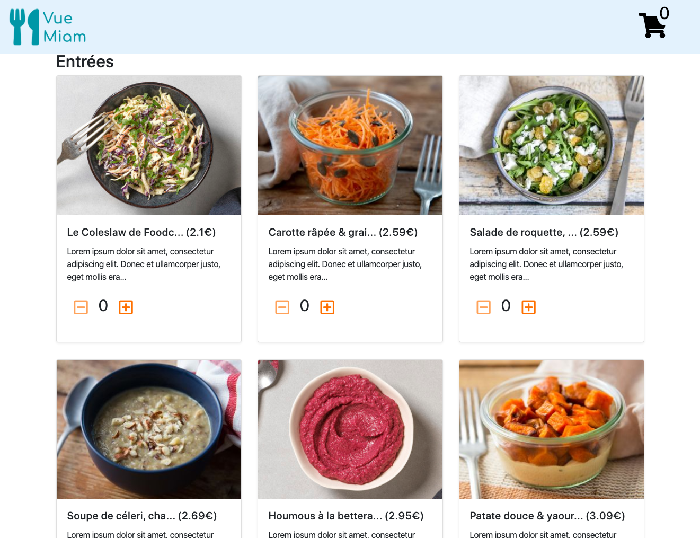
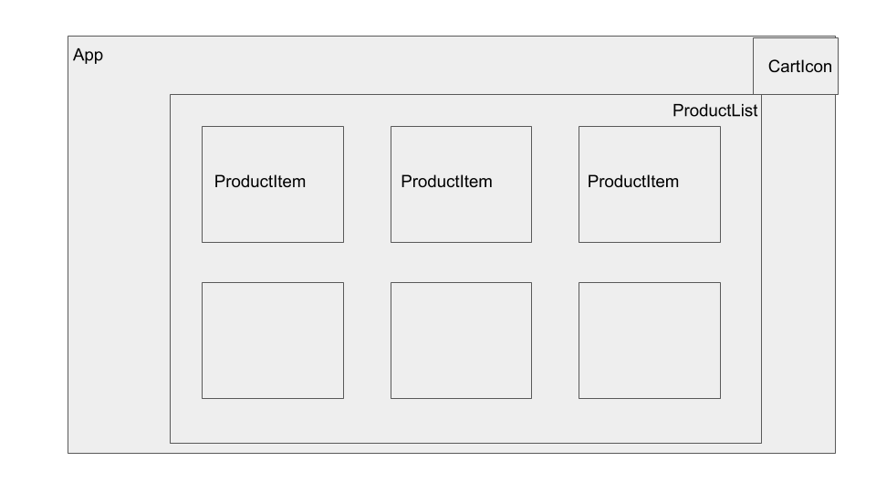

## 📚 Introduction


### 🎬 WOOCLAP: À quoi vous fait penser Vue.js ?

Rendez-vous sur https://www.wooclap.com/.


### 🗒 Définition officielle

> Vue (pronounced `/vjuː/`, like view) is a progressive framework **for building user interfaces**. Unlike other monolithic frameworks, Vue is designed from the ground up to be **incrementally adoptable**. The core library is focused **on the view layer only**, and is easy to pick up and integrate with other libraries or existing projects.

> On the other hand, Vue is also perfectly capable of powering sophisticated Single-Page Applications **when used in combination with modern tooling and supporting libraries**.

👉 Commentons les points importants.


### 🗒 Appli minimale

```html
<!DOCTYPE html>
<html>
<head>
  <title>Ma première appli Vue</title>
  <script src="https://cdn.jsdelivr.net/npm/vue/dist/vue.js"></script>
</head>
<body>
  <div id="app">
    {{ message }}
    <span v-bind:title="tooltip">Survolez-moi</span>
  </div>

  <script>
    var app = new Vue({
      el: '#app',
      data: {
        message: 'Hello Vue!',
        tooltip: 'Vous avez chargé cette page le ' + new Date().toLocaleString()
      }
    })
  </script>
</body>
</html>
```


### 👉 Quelles caractéristiques de Vue.js pouvez-vous observer ?

Simplement en observant le code de l'appli minimale ci-dessus, vous pouvez observer certaines caractéristiques de Vue.js :

- Quel est l'outillage ou le stack technique requis pour faire tourner une appli Vue ?
- Quelles techniques semblent utilisées pour rendre l'interface dynamique ?


### 🗒 Installation

- Vue supporte IE9 et plus.
- Dernière version stable : 2.6.11

**Option 1 - Inclusion directe avec `<script>`**

Télécharger Vue et inclure la librairie avec une balise `<script>`. Elle sera dispo via la variable globale `Vue`.

On peut aussi passer par un CDN :

```html
<script src="https://cdn.jsdelivr.net/npm/vue/dist/vue.js"></script>
```

**Option 2 - Installation via Vue CLI :**

```cmd
npm install -g @vue/cli
```

Puis, on peut créer un projet avec la commande :

```cmd
vue create PROJECT_NAME
```

Plus d'infos sur Vue CLI : https://cli.vuejs.org/


### 🗒 Instance de `Vue`

Le point de départ de toute application Vue, c'est une **instance de `Vue`** :

```js
var vm = new Vue({
  // options
})
```

On appelle souvent l'instance `vm` pour ViewModel (du pattern MVVM).


### 🗒 Données et méthodes

On peut passer un **objet d'options** au constructeur de `Vue` :

```js
var vm = new Vue(options)
```

**Données**

L'objet options peut contenir des données sous la propriété `data` :

```js
var options = {
  data: {
    newTodoText: '',
    visitCount: 0,
    hideCompletedTodos: false,
    todos: [],
    error: null
  }
};
```

Toutes les propriétés déclarées dans `data` deviendront **réactives**. Ça signifie qu'elles seront surveillées par Vue et que l'interface (= la vie) sera mise à jour automatiquement à chaque fois qu'elles changent.

Les propriétés déclarées dans `data` sont également **directement accessibles dans le template de la vue**.

Par exemple, on pourrait afficher avec une interpolation la propriété `visitCount` déclarée plus haut :

```html
<p>Nombre de visites : {{ visitCount }}</p>
```

**Méthodes**

L'objet options peut contenir des méthodes sous la propriété `methods` :

```js
var options = {
  methods: {
    sayHello: function () {
      // Dans une méthode, this désigne l'instance de Vue
      alert(this.message);
    }
  },
  data: (
    message: 'Message de salutation',
  },
};
```

Dans les méthodes, le mot clé `this` référence l'instance de la Vue courante.

Les méthodes déclarées dans `methods` sont **directement accessibles dans le template de la vue**.

Par exemple, on pourrait déclencher la méthode `sayHello` au clic sur un bouton :

```html
<button v-on:click="sayHello">Dis bonjour</button>
```


### 🗒 Les hooks cycle de vie de l'instance

Chaque instance de Vue passe par plusieurs étapes d'initialisation lorsqu'elle est créée. Par exemple, elle met en place la surveillance des données, compile le template, insère l'instance dans le DOM...

À chacune de ces étapes, l'instance exécute des fonctions spéciales appelées **hooks cycle de vie**.

C'est l'opportunité pour l'utilisateur d'exécuter son code à des moments stratégiques.

💁‍♂️ Remarque : Ces hooks sont similaires aux méthodes "cycle de vie" de React.

Quelques exemples de hooks :

- `created` : l'instance vient d'être créée
- `mounted` : l'instance vient d'être insérée dans le DOM
- `destroyed` : l'instance vient d'être détruite

Exemple d'utilisation du hook `created` :

```js
new Vue({
  data: {
    a: 1
  },
  created: function () {
    // `this` points to the vm instance
    console.log('a is: ' + this.a)
  }
})
// => "a is: 1"
```

⚠️ Dans les hooks, `this` pointe sur l'instance à laquelle le hook appartient --&gt; Ne pas utiliser les fonctions flèches qui n'ont pas de "this".


### 🗒 Schéma d'illustration des hooks


## 💻 TP 1 : Créer une appli


### Partie 1 : Première appli Vue avec une balise `<script>`

- Créez un fichier HTML dans lequel vous chargerez Vue avec une balise `<script>`.
- Dans ce fichier HTML, créez une appli Vue minimale qui affiche la date courante. Ajoutez un bouton qui rafraîchit la date à chaque fois qu'on le clique.
- Comment feriez-vous pour que la date se rafraîchisse automatiquement (sans cliquer sur le bouton) ?


### Partie 2 : Deuxième appli Vue avec Vue CLI

**Pourquoi Vue CLI ?** Vue CLI gère tout l'outillage qui permet d'avoir une appli plus robuste avec transpilation ES6, imports/exports, un système de build basé sur Webpack, des tests unitaires... Plus d'infos : https://cli.vuejs.org/

- Dans VS Code, installez l'extension [Vetur](https://marketplace.visualstudio.com/items?itemName=octref.vetur). Elle fournit plein de fonctionnalités utiles pour Vue.js : syntax highlighting, IntelliSense, snippets, formatting...
- Récupérez le fichier [`vue-miam-starter.zip`](assets/vue-miam-starter.zip), décompressez-le, et ouvrez le dossier `vue-miam-starter` obtenu dans VS Code.
  - Pour info, ce ZIP contient une application créée avec Vue CLI. En plus des fichiers standard, j'ai ajouté quelques librairies supplémentaires : `bootstrap`, `@fortawesome/fontawesome-free`, `json-server`, et `vue-router`. J'ai aussi légèrement modifié la configuration de ESLint (voir remarque dans les "annexes").
- Ouvrez un terminal VS Code :
  - Installez les dépendances du projet avec `npm install`.
  - Puis exécutez `npm run serve` et vérifiez que tout s'affiche correctement dans le navigateur.

### Présentation de l'appli fil rouge : Vue Miam




## 💻 TP 2 : Créer la classe `Product` et le service `ProductService`

**Product**

Créez la classe `Product` dans le fichier `models/product.js`, avec les propriétés suivantes (⚠️ les types sont donnés à titre indicatif) :

- id (number)
- name (string)
- type (string)
- description (string)
- stock (number)  // Quantité dispo
- photo (string)
- price (number)
- slug (string)
- tags (string[])
- nutritionalInfo (string)

**ProductService**

Créez la classe `ProductService ` dans le fichier `services/product-service.js`, avec les méthodes suivantes :

- getProducts() — Renvoie la liste de tous les produits (array de `Product`)
- getProduct(productId) — Renvoie un produit spécifique (instance de `Product`)

Pour faire les requêtes HTTP, vous utiliserez la [Fetch API](https://developer.mozilla.org/en-US/docs/Web/API/Fetch_API), et pour le backend, vous lancerez JSON Server (`npm run api:start`).


## 📚 Composants - Les bases

### 🗒 Exemple de base

Un composant est une **instance de Vue réutilisable, avec un nom**.

Voici un exemple de composant Vue, appelé `button-counter` :

```js
Vue.component('button-counter', {
  data: function () {
    return {
      count: 0
    }
  },
  template: '<button v-on:click="count++">Vous m'avez cliqué {{ count }} fois.</button>'
})
```

Ce composant peut être utilisé (= affiché) dans une instance de Vue créée avec `new Vue` :

```html
<div id="components-demo">
  <button-counter></button-counter>
</div>
```

```js
new Vue({ el: '#components-demo' })
```

**Comparaison entre un composant et une instance de `Vue` :**

- **Nom.** Un composant possède un nom. Pas une Vue.
- **Affichage.** Un composant est affiché via une balise basée sur son nom. Une Vue vient s'accrocher à un élément DOM existant, dont le sélecteur est défini dans l'option `el`.
- **Données.** L'option `data` d'un composant est une fonction. L'option `data` d'un Vue est un objet.

Comme les composants sont des instances de Vue, ils acceptent plusieurs des options supportées par `new Vue`, telles que `data`, `computed`, `watch`, `methods` et les hooks cycle de vie. Il y a tout de même quelques options non autorisées, par exemple `el`.


### 🗒 Réutiliser un composant

Un composant peut être réutilisé plusieurs fois :

```html
<div id="components-demo">
  <button-counter></button-counter>
  <button-counter></button-counter>
  <button-counter></button-counter>
</div>
```

Chaque composant maintient son propre état (ici, son propre `count`), car chaque affichage crée une instance différente.

**⚠️ La propriété `data` doit être une fonction**

Dans une instance de Vue, la propriété `data` est un objet :

```js
data: {
  count: 0
}
```

Dans un composant, **la propriété `data` doit être une fonction**. C'est ce qui permet à chaque instance d'avoir son propre exemplaire :

```js
data: function () {
  return {
    count: 0
  }
}
```

⛔️ Si vous déclarez par erreur les `data` d'un composant sous forme d'objet, les données seront partagées entre toutes les instances du composent. Dans l'exemple précédent, cliquer un bouton incrémenterait le compteur pour tous les boutons.


### 🗒 Passer des données aux composants enfants via les "props"

Pour qu'un composant soit réutilisable, on doit pouvoir lui passer des données différente à chaque affichage.

Imaginons un composant qui affiche un billet de blog. On veut pouvoir lui passer le billet de blog à afficher.

Les données qu'on passe à un composant (depuis son parent) s'appelle des "props".

C'est au composant de **déclarer le nom des props qu'il accepte** dans l'option `props` (array de strings). Il pourra ensuite utiliser ces props directement dans les bindings de son template, exactement comme des propriétés `data`.

```js
Vue.component('blog-post', {
  props: ['post'],
  template: `
    <div class="blog-post">
      <h3>{{ post.title }}</h3>
      <div v-html="post.content"></div>
    </div>
  `
})
```

Un composant peut avoir **autant de props qu'il le souhaite**, et une prop peut contenir **n'importe quelle valeur**.

Lorsqu'on affiche un composant avec props, on peut binder à l'une de ses props avec la syntaxe `v-bind:PROPNAME="EXPRESSION"`. Par exemple :

```html
<blog-post
  v-for="post in posts"
  v-bind:key="post.id"
  v-bind:post="post"
></blog-post>
```

Si on passe une chaîne littérale à la prop, on peut l'utiliser avec la même syntaxe qu'un simple attribut HTML (sans `v-bind`) :

```html
<hello name="Vince"></hello>
```

### 🗒 Un seul élément racine

Un template de composant doit posséder un seul élément à sa racine. Autrement dit, on ne peut pas avoir deux balises "frères" à la racine d'un template de composant.

⛔️ NON :

```html
<h3>{{ title }}</h3>
<div v-html="content"></div>
```

✅ OUI :

```html
<div class="blog-post">
  <h3>{{ title }}</h3>
  <div v-html="content"></div>
</div>
```

### 🗒 Écouter les événements de l'enfant (`$emit`)

Un composant peut émettre un événement custom à son parent avec la méthode système `$emit()`.

Dans l'exemple ci-dessous, un clic sur le bouton émettra un événement custom appelé "enlarge-text" (le nom de l'événement est arbitraire) :

```html
<!-- Quelque part dans le template du composant "blog-post" -->
<button v-on:click="$emit('enlarge-text')">
  Agrandir le texte
</button>
```

Côté parent, on peut écouter l'événement custom avec le même binding que pour les événements DOM standard (`v-on:EVENT`). Il suffit de mettre le nom de l'événement custom à la place du nom de l'événement DOM :

```html
<blog-post
  ...
  v-on:enlarge-text="postFontSize += 0.1"
></blog-post>
```

Si on le souhaite, l'enfant peut émettre des données spécifiques à l'événement, en utilisant le 2ème paramètre de la méthode `emit()` :

```html
<!-- Quelque part dans le template du composant "blog-post" -->
<button v-on:click="$emit('enlarge-text', 0.1)">
  Agrandir le texte
</button>
```

Côté parent, ces données spécifiques sont reçues dans la variable système `$event` :

```html
<blog-post
  ...
  v-on:enlarge-text="postFontSize += $event"
></blog-post>
```

Le event handler peut également être une méthode du composant parent :

```html
<blog-post
  ...
  v-on:enlarge-text="onEnlargeText"
></blog-post>
```

```js
methods: {
  onEnlargeText: function (enlargeAmount) {
    this.postFontSize += enlargeAmount
  }
}
```


## 💻 TP 3 : Découper l'interface en composants

Créer les différents composants de sorte que le découpage de l'appli ressemble à ça :



Remarques :

- Vous placerez tous vos composants dans le dossier `src/components` du projet. Essayez de les appeler comme sur le schéma : `ProductList`, `ProductItem` et `CartIcon`.
- Pour le HTML, vous utiliserez le code fourni dans `gabarits_html/product-list.html`.
- ⚠️ Pour l'instant, vos composants affichent des **données statiques** et **ne communiquent pas entre eux**. Nous utiliserons les props et les requêtes HTTP dans le TP suivant.


## 📚 Syntaxes de template


Dans cette section, nous allons voir toutes les syntaxes qu'on peut utiliser dans un template Vue.


### 🗒 Introduction aux templates

Dans un composant ou une application Vue, l'IHM est stockée dans un *template*.

Ce template utilise une syntaxe **basée sur le HTML classique**, avec en plus des **fonctionnalités spécifiques à Vue** (interpolation, directives...).

Caractéristiques de cette syntaxe :

- Basée sur HTML, compatible avec un parser HTML "standard".
- Compilée en appels de fonction "render". On pourrait écrire ces appels directement au lieu d'utiliser un template HTML (impératif vs. déclaratif).
- Les mises à jour de l'interface utilisent un principe de diff sur un DOM virtuel.

💁‍♂️ REMARQUE : Les templates Vue sont **très proches** des templates React.


### 🗒 Interpolations

**Texte**

Pour afficher du texte dynamiquement, utiliser les doubles accolades (ou "moustaches") :

```html
<span>Message : {{ msg }}</span>
```

Interpolation "à usage unique" :

```html
<span v-once>Ce message ne changera jamais : {{ msg }}</span>
```

**Attributs**

Pour modifier les attributs HTML, utilser la directive `v-bind:ATTR`, où `ATTR` est le nom de l'attribut HTML à modifier.

Donner un id dynamique à une balise :

```html
<div v-bind:id="dynamicId">...</div>
```

Désactiver un bouton dynamiquement :

```html
<!-- isButtonDisabled doit contenir une valeur truthy ou falsy -->
<button v-bind:disabled="isButtonDisabled">Button</button>
```

**Expressions JavaScript**

On rencontre souvent des bindings à une propriété du modèle, mais dans tout binding, on peut aussi utiliser une *expression JavaScript*.

Ainsi, toutes ces valeurs sont valides :

```html
{{ number + 1 }}

{{ ok ? 'YES' : 'NO' }}

{{ message.split('').reverse().join('') }}

<div v-bind:id="'list-' + id"></div>
```

⚠️ Un binding ne peut contenir qu'une seule expression (pas plusieurs ; et pas d'instruction) et certaines variables globales JavaScript ne sont pas accessibles dans les bindings.


### 🗒 Propriétés calculées

Définition d'une propriété calculée :

- Valeur calculée à partir d'une ou plusieurs autres propriétés.
- Réactive = valeur recalculée autonomatiquement quand la valeur d'une de ses "dépendances" réactives change.
- Mise en cache = valeur pas recalculée tant que la valeur des dépendances ne change pas.

**Syntaxe**

Une propriété calculée est déclarée dans l'option `computed` de l'objet Vue.

Dans l'exemple, la propriété calculée `priceVAT` calcule automatiquement un prix avec TVA à partir de la propriété `price`.

```js
{
  el: '...',
  data: {
    price: 20
  },
  computed: {
    priceVAT: function () {
      return .20 * this.price
    }
  }
})
```

**Les propriétés calculées permettent d'améliorer la lisibilité des templates**

😕 SANS propriété calculée (BOF, le template n'est plus déclaratif) :

```html
<div id="example">
  {{ message.split('').reverse().join('') }}
</div>
```

✅ AVEC propriété calculée (MIEUX, on sort la logique du template) :

```html
<div id="example">
  <p>Original message: "{{ message }}"</p>
  <p>Computed reversed message: "{{ reversedMessage }}"</p>
</div>
```

```js
var vm = new Vue({
  el: '#example',
  data: {
    message: 'Hello'
  },
  computed: {
    reversedMessage: function () {  // propriété calculée (getter)
      // `this` points to the vm instance
      return this.message.split('').reverse().join('')
    }
  }
})
```


### 🗒 Watchers

Les watchers sont une alternative aux propriétés calculées.

Il permettent de réagir aux changements d'une propriété en exécutant un bout de code arbitraire, qui pourra mettre à jour une ou plusieurs autres propriétés.

**Syntaxe**

Un watcher est déclaré dans l'option `watcher` de l'objet Vue.

```js
{
  el: '...',
  data: {
    firstName: ''
  },
  watcher: {
    // Fonction exécutée à chaque fois que `firstName` change
    firstName: function () {
      // ...
    }
  }
})
```

⚠️ Le nom du watcher doit matcher le nom d'une propriété `data` existante.

**Exemple de watcher**

On pourait utiliser un watcher pour créer un **champ de recherche "autocomplete"**.

Côte HTML, on trouve le champ de recherche avec la liste des (futurs) résultats :

```html
<div id="example">
  <input v-model="searchedText">
  <ul>
    <li v-for="result in results">{{ result }}</li>
  </ul>
</div>
```

Côté JS, on surveille la propriété `searchedText` : dès qu'elle change, on lance une requête HTTP et on met à jour la propriété `results` avec les résultats.

```js
var vm = new Vue({
  el: '#example',
  data: {
    searchedText: '',
    results: []
  },
  watch: {
    // Fonction exécutée à chaque fois que `searchedText` change
    searchedText: function (newSearchedText, oldSearchedText) {
      // ATTENTION, PSEUDO-CODE...
      var vm = this;
      fetch(`https://api.search.com?q=${newSearchedText}`)
        .then(resp => vm.results = data.json());
    }
  }
})
```


### 🗒 Directives

Les directives sont des attributs un peu spéciaux qui commencent par `v-`, par exemple :

```html
<p v-if="seen">Mainteant je suis visible</p>
```

Ici, la directive `v-if` insère l'élément `<p>` basé sur la "truthiness" de la valeur de l'expression `seen` (si `seen` est truthy, alors l'élément `<p>` est inséré).

Toutes les directives ont pour valeur une expression JavaScript, à l'exception de `v-for`.

On peut trouver les directives sur les balises HTML, mais aussi sur les composants custom :

```html
<todo-item
  v-for="todo in todos"
  v-bind:todo="todo"
></todo-item>
```

**Argument de directive**

Certaines directives prennent un "argument", séparé du nom de la directive par ":" :

```cmd
v-DIRECTIVE:ARGUMENT
```

Par exemple, pour binder un attribut HTML (l'argument est le nom de l'attribut, ici `href`) :

```html
<a v-bind:href="url"> ... </a>
```

Ou pour binder un événement DOM (l'argument est le nom de l'événement, ici `click`) :

```html
<a v-on:click="doSomething"> ... </a>
```


### 🗒 Raccourcis pour `v-bind` et `v-on`

Les deux bindings les plus fréquents, `v-bind` et `v-on`, ont une syntaxe raccourcie.

Raccourci pour `v-bind`:

```html
<!-- Syntaxe entière -->
<a v-bind:href="url"> ... </a>

<!-- Syntaxe raccourcie -->
<a :href="url"> ... </a>
```

Raccourci pour `v-on`:

```html
<!-- Syntaxe entière -->
<a v-on:click="doSomething"> ... </a>

<!-- Syntaxe raccourcie -->
<a @click="doSomething"> ... </a>
```


### 🗒 Bindings de classes

💁‍♂️ REMARQUE : On peut binder `v-bind:class` et `v-bind:style` à une expression qui renvoie une chaîne content des noms de classe CSS ou des styles CSS, mais Vue fournit quelques raccourcis syntaxiques pour faciliter l'utilisation de classes ou de styles dynamiques.

Plutôt qu'une chaîne, on peut binder un objet à `v-bind:class` :

```html
<div class="static" v-bind:class="{ active: isActive }"></div>
```

Les propriétés de l'objet qui valent `true` seront ajoutées sous forme de classes  aux classes CSS existantes de la balise.

Dans l'exemple, si `isActive` vaut true, le HTML final sera :

```html
<div class="static active"></div>
```

💁‍♂️ Notez que le binding est dynamique. Si la valeur de la propriété `isActive` change, la classe sera automatiquement ajoutée/retirée du HTML.

**Bindings de classe et composants**

Si vous utilisez l'attribut `class` sur un composant custom, les classes spécifiées seront ajoutées aux classes de l'élément racine du composant.

Par exemple, si l'on prend le composant suivant :

```js
Vue.component('my-component', {
  template: '<p class="foo bar">Hi</p>'
})
```

Et qu'on lui passe quelques classes :

```html
<my-component class="baz boo"></my-component>
```

Le HTML final envoyé au navigateur sera :

```html
<p class="foo bar baz boo">Hi</p>
```

### 🗒 Bindings de styles

Fonctionnement similaire aux classes. Plutôt qu'une chaîne, on peut binder un objet à `v-bind:style` :

```html
<div v-bind:style="styleObject"></div>
```

En supposant par exemple les données suivantes :

```js
data: {
  styleObject: {
    color: 'red',
    fontSize: '13px'
  }
}
```

Là aussi, le binding est dynamique (si `styleObject` change, les styles de la vue sont mis à jour automatiquement).


### 🗒 Affichage conditionnel avec `v-if`

La directive `v-if` permet d'afficher un bloc de HTML de manière conditionnelle. Le bloc est affichée si l'expression bindée renvoie une valeur truthy.

```html
<h1 v-if="awesome">Vue c'est trop bien !</h1>
<h1 v-else>Oh non 😢</h1>
```

La directive `v-else` — FACULTATIVE — permet d'indiquer la condition "else" du `v-if`. Elle doit se trouver IMMÉDIATEMENT après la directive `v-if`.

Si le `v-if` doit porter sur plusieurs balises qui n'ont pas de parent commun, on peut introduire une balise `<template>` qui fait office de "conteneur". Cette balise n'a pas de rendu dans le HTML final, elle sert uniquement à recevoir le `v-if`.

```html
<template v-if="ok">
  <h1>Titre</h1>
  <p>Paragraphe 1</p>
  <p>Paragraphe 2</p>
</template>
```

#### 🗒 Alternative à `v-if` : `v-show`

Une autre technique pour faire de l'affichage conditionnel est la directive `v-show`.

```html
<h1 v-show="ok">Hello!</h1>
```

Son fonctionnement est quasi identique à `v-if`. La différence est qu'un élément avec une directive `v-show` sera toujours présent dans le DOM, et **affiché/masqué via la propriété CSS `display`**.

Avec `v-if`, l'élément est **physiquement ajouté ou retiré du DOM**, ce qui est plus coûteux en terme de performance, mais permet d'éviter de compiler un gros fragment de template quand l'expression est falsy, ou d'éviter certaines erreurs d'affichage quand les données ne sont pas encore dispo (données asynchrones renvoyées par HTTP).


### 🗒 Affichage des listes (`v-for`)

La directive `v-for` permet d'afficher le contenu d'un array sous forme de liste d'éléments.

On passe à `v-for` une syntaxe spéciale au format `item in items`, où :

- `items` est le tableau de données à afficher
- `item` représente l'itération en cours

<div></div>

```html
<ul id="example">
  <li v-for="item in items">
    {{ item.message }}
  </li>
</ul>
```

```js
var vm = new Vue({
  el: '#example',
  data: {
    items: [
      { message: 'Foo' },
      { message: 'Bar' }
    ]
  }
})
```

Dans les blocs `v-for`, on peut accéder à l'itération en cours, mais aussi à toutes les propriétés du scope parent.

On peut aussi accéder à l'indice de l'itération en cours, avec `index` :

```html
<ul>
  <li v-for="(item, index) in items">{{ index }} - {{ item.message }}</li>
</ul>
```

Résultat affiché :

- Foo
- Bar


#### 🗒 `v-for` et performances

Pour aider Vue à réutiliser les noeuds DOM déjà affichés, il est recommandé d'affecter une clé unique (propriété `key`) à chaque élément d'une itération `v-for`.

```html
<div v-for="item in items" v-bind:key="item.id">
  <!-- content -->
</div>
```

Ainsi, lors du rafraîchissement, les données dont la clé est déjà présente dans le DOM pourront recycler leur élément DOM existant.


#### 🗒 Filter ou ordonner les listes

Il arrive qu'on veuille filtrer ou ordonner les données affichées à l'écran, sans toucher aux données originales.

Pour cela, on peut utiliser une **propriété calculée** (déclarée dans `computed`) :

```html
<li v-for="n in evenNumbers">{{ n }}</li>
```

```js
data: {
  numbers: [ 1, 2, 3, 4, 5 ]
},
computed: {
  evenNumbers: function () {
    return this.numbers.filter(function (number) {
      return number % 2 === 0
    })
  }
}
```

On peut aussi utiliser une **méthode** (déclarée dans `methods`) :

```html
<li v-for="n in even(numbers)">{{ n }}</li>
```

```js
data: {
  numbers: [ 1, 2, 3, 4, 5 ]
},
methods: {
  even: function (numbers) {
    return numbers.filter(function (number) {
      return number % 2 === 0
    })
  }
}
```

### 🗒 `v-for` et composants

On peut utiliser `v-for` sur un composant custom, comme sur n'importe quel élément :

```html
<my-component v-for="item in items" :key="item.id"></my-component>
```

⚠️ Aucune donnée n'est transmise automatiquement au composant `<my-component>` dans ce scénario. C'est au développeur de passer les données explicitement sous forme de "prop".

Par exemple :

```html
<my-component v-for="item in items" v-bind:item="item"></my-component>
```


## 💻 TP 4 : Afficher les produits dynamiquement

- À la création du composant `ProductList`, chargez la liste des produits grâce au `ProductService` créé précédemment.
- Utilisez une "prop" pour passer le produit à afficher à `ProductItem`.
- Dans `ProductList`, séparez la liste des produits en 3 sections, basées sur la valeur de la propriété `product.type` :
  - Entrées (`product.type === 'STARTER`)
  - Plats (`product.type === 'MAIN_COURSE`)
  - Desserts (`product.type === 'DESSERT`)
- Dans `ProductItem`, utilisez des propriétés calculées pour tronquer la longueur du titre à 20 caractères et la longueur de la description à 100 caractères.


## 📚 Gestion de l'interactivité


### 🗒 Gestion des événements DOM avec `v-on`

On peut utiliser la directive `v-on:EVENT="..."` pour exécuter du code lorsqu'un événement DOM est déclenché.

```html
<div id="example">
  <button v-on:click="counter += 1">Ajouter 1</button>
  <p>Le bouton a été cliqué {{ counter }} fois.</p>
</div>
```

```js
var vm = new Vue({
  el: '#example',
  data: {
    counter: 0
  }
})
```

Dans l'exemple, on a bindé directement une **instruction** à l'événement "click" (`counter += 1`).

Il est plus fréquent de binder une **méthode**, ce qui permet de sortir la logique du template :

```html
<div id="example">
  <button v-on:click="increment">Ajouter 1</button>
  <p>Le bouton a été cliqué {{ counter }} fois.</p>
</div>
```

```js
var vm = new Vue({
  el: '#example',
  data: {
    counter: 0
  },
  methods: {
    increment: function (event) {
      // `this` inside methods points to the Vue instance
      this.counter += 1;
      // `event` est l'événement DOM natif
      if (event) {
        console.log(event.target.tagName)
      }
    }
  }

})
```

On voit que l'event handler `increment` récupère automatiquement une référence à l'événement DOM `event`, ce qui permet d'accéder à des propriétés et méthodes intéressantes.

💁‍♂️ IMPORTANT : Dans l'exemple ci-dessus, on a bindé le **nom de la méthode sans parenthèses** :

```cmd
v-on:click="increment"
```
 
On peut aussi binder un **appel de méthode**. Cela permet de passer des arguments à la méthode :

```html
<button v-on:click="say('hi')">Say hi</button>
<button v-on:click="say('what')">Say what</button>
```

Si besoin, on peut combiner le passage d'arguments et la récupération de l'événement DOM natif grâce à `$event` :

```html
<button v-on:click="say('hi', $event)">Say hi</button>
```


### 🗒 Modifieurs d'événement (e.g. `v-on:submit.prevent`)

Les modifieurs d'événement sont des suffixes qu'on accole au nom de l'événement, séparé par un point :

```cmd
v-on:EVENT.MODIFIER
```

Ils permettent de modifier le comportement de l'événement en appelant certaines de ses méthodes ou en changeant certains de ses paramètres.

Exemples de modifieurs fréquents :

- `.stop` : Appelera `event.stopPropagation()` sur l'événement
- `.prevent` : Appelera `event.preventDefault()` sur l'événement

Exemples d'utilisation :

```html
<!-- la propagation du clic sera stoppée -->
<a v-on:click.stop="doThis"></a>

<!-- l'événement submit ne rechargera pas la page (comportement par défaut en HTML) -->
<form v-on:submit.prevent="onSubmit"></form>
```


### 🗒 Bindings de formulaire

La directive `v-model` permet de créer un binding **bidirectionnel** entre un champ de formulaire et une propriété du modèle Vue :

- Quand la propriété du modèle change, le champ HTML est mis à jour.
- Quand l'utilisateur modifie le champ HTML, la propriété du modèle est mise à jour.

C'est donc le modèle défini côté JS qui devient la **source de vérité**. Il ne faut plus chercher à setter manuellement la valeur du champ (avec l'attribut "value" par exemple).

Exemple :

```html
<input v-model="message" placeholder="modifiez-moi">
<p>Le texte est : {{ message }}</p>
```

💁‍♂️ REMARQUE : La directive `v-model` s'adapte automatiquement au champ où elle se trouve : pour un champ `<input type="text">`, `v-model` se bindera à l'attribut "value" ; pour une checkbox, `v-model` se bindera à l'attribut "checked"...


## 💻 TP 5 : Ajouter les produits au panier

REMARQUE : La complexité de cet exercice est de faire communiquer plusieurs composants entre eux. Pour cela, on va utiliser une instance de classe `CartService` qui représentera la "source de vérité" pour le contenu du panier. Tous les composants ayant besoin d'accéder au contenu du panier ou de le modifier injecteront l'instance unique de `CartService` grâce à l'**injection de dépendances**.

**CartService**

Commencez par créer une classe `CartService` qui gèrera la logique métier d'ajout au panier (dans le fichier `services/cart-service.js`).

Propriétés :

- `productInfo` : tableaux de { Product, quantity }
- `totalAmount` : montant total des produits dans le panier
- `numProducts` : nombre total de produits dans le panier

Méthodes :

- `addProduct(product)` : Ajoute une unité d'un produit au panier et recalcule les totaux.
- `removeProduct(product)` : Retire une unité d'un produit du panier et recalcule les totaux.
- `getQuantityForProduct(productId)` : Renvoie la quantité d'un produit précis dans le panier.

Enfin, pour garantir que `CartService` est un **singleton** dans l'application, vous instancierez cette classe dans le composant `App` et vous exposerez l'instance créee via l'injection de dépendance (propriété `provide` du composant App).

Référez-vous à la doc de la DI pour la syntaxe exacte : https://vuejs.org/v2/api/#provide-inject

**Composants**

On peut maintenant coder les composants qui communiquent avec le `CartService`.

Créez un composant `ProductButtons` qui encapsule les boutons -/+ :

- Ce composant se procure le `CartService` grâce à l'injection de dépendance (propriété `inject`). Il l'utilise pour récupérer et modifier la quantité de produit.
- Quand les boutons sont cliqués, ils doivent incrémenter / décrémenter le compteur de produits.
- Désactiver le bouton "Moins" quand la quantity est à zéro, et le bouton "Plus" quand la quantité est à 10.

Mettez à jour le composant `CartIcon` :

- Injectez le `CartService` dans ce composant grâce à l'injection de dépendance.
- Faites en sorte que le chiffre affiché sur l'icône Panier représente le nombre total d'articles dans le panier, avec mise à jour **en temps réel**.

💁‍♂️ INFO : Pour que `CartService` participe à la détection de changement, il peut être nécessaire de le déclarer dans les `data` des composants qui l'utilisent.


## 💻 TP 6 : Créer les routes de l'application

Objectif : Avoir 3 pages distinctes pour notre application :

- La liste des produits
- Le détail d'un produit (affiché quand on clique sur un produit depuis la liste)
- Le détail du panier (affiché quand on clique sur l'icône Panier en haut à droite)

💁‍♂️ INFO : Pour cet exercice, vous utiliserez la documentation de [vue-router](https://router.vuejs.org/), le routeur officiel de Vue.js. Pour info, cette librairie n'est pas inclue avec Vue.js mais elle est déjà installée dans notre projet.

- Dans le fichier `routes.js`, déclarez les routes suivantes et créez une instance de routeur :
  - Route "" (vide) redirige vers "products".
  - Route "products" affiche le composant `ProductList`.
  - Route "product/:productId" affiche le composant `ProductDetail`.
  - Route "cart" affiche le composant `CartDetail`.
- Rattachez le routeur créé à l'application principale qui se trouve dans `main.js`.
- Modifier nos composants pour utiliser le routeur :
  - Le template du composant principal (`<App>)` doit maintenant afficher les composants routés, grâce à la balise `<router-view></router-view>`.
  - Un clic sur un produit doit naviguer vers la route "product/:productId".
  - Un clic sur l'icône Panier doit naviguer vers la route "cart".
  - Sur le détail d'un produit, on peut revenir à la liste en cliquant "Retour à la liste".
 - Sur le détail du panier, on peut revenir à la liste en cliquant "Annuler".
- Dans le composant `ProductDetail`, vous récupérerez le paramètre `productId` passé dans l'URL pour charger afficher le produit correspondant grâce au service `ProductService` (récréer une instance, mais ça serait mieux de passer par la DI).
- Dans le composant `CartDetail`, vous récupérerez le contenu du panier grâce au service `CartService` (à injecter avec la DI).


## 💻 TP 7 (BONUS) : Filtrer les produits en mode autocomplete

⚠️ Uniquement s'il reste du temps.

Codez un composant `SearchProduct` contenant un champ de recherche qui filtre les produits en temps réel.

Remarques :

- Affichez ce composant dans la navbar.
- La liste des produits doit se filtrer **en direct**, au fur et à mesure que l'utilisateur tape.


## 🤔 BRAINSTORMING: Qu'avez-vous pensé de Vue.js ?

Rendez-vous sur https://www.wooclap.com/ pour donner votre avis sur React.

- Avez-vous envie d'en apprendre plus ?
- Points positifs ?
- Points négatifs ?


-----


## ----- 📚 Annexes -----


### 🗒 Liste de toutes les directives `v-`

- `v-bind:ATTR="propName"` : Binde une propriété du modèle à un attribut HTML (`ATTR` est le nom de l'attribut).
- `v-bind:PROP="propName"` : Binde une propriété du modèle à une propriété de composant (`PROP`).
- `v-if="expression"` : Affiche un fragment de HTML de manière conditionnelle. Le fragment est inséré dans le DOM si l'expression renvoie true, pas inséré sinon.
- `v-for="item in items"` : Boucle sur un fragment de HTML pour le répéter.
- `v-bind:key="propName"` : Identifiant unique dans une boucle `v-for`.
- `v-on:EVENT="methodName"` : Binde une méthode à un événement DOM (`EVENT` est le nom d'un événement DOM). La méthode doit être déclarée dans l'objet `methods` de l'application.
- `v-model="propName"` : Binde la valeur d'un champ de formulaire à une propriété du modèle (liaison bidirectionnelle).


### 🗒 Remarque sur la configuration ESLint de Vue CLI

La configuration ESLint par défaut d'un projet Vue CLI est très stricte.

Elle interdit notamment l'usage de `console.log()` dans le code, et le fait de déclarer des variables non utilisées.

C'est valable en production, mais assez pénible en phase de développement. Ces 2 règles ont donc été désactivées dans le fichier `package.json` :

```json
  "eslintConfig": {
    ...
    "rules": {
      "no-console": "off",
      "no-unused-vars": "off"
    },
    ...
  },
```

Plus d'infos sur la config ESLint : https://eslint.org/docs/user-guide/configuring


### 🗒 Fonctionnement des applis Vue CLI

Il y a certains partis pris dans une application générée par Vue CLI qui peuvent différer de ce qu'on a vu dans le reste de la formation.


#### Single-File Components

Dans une appli Vue CLI, 1 composant = 1 fichier `.vue`.

Le fichier `.vue` combine en un seul endroit le template, le JavaScript et les CSS d'un même composant.

Structure d'un fichier `.vue` :


⛔️ Donc, vous n'utiliserez pas les propriétés `el` ou `template` dans un fichier `.vue`. 

Plus d'infos : https://vuejs.org/v2/guide/single-file-components.html


#### Composants déclarés sous forme d'objets exportés

Dans la partie JavaScript d'un fichier `.vue`, les composants sont déclarés sous la forme d'**objets litéraux exportés**.

Par exemple :

```html
<script>
// Ceci est un composant
export default {
  name: 'HelloWorld',
  props: {
    name: String
  }
}
</script>
```

C'est parce que ces composants sont **destinés à être importés par un autre fichier** qui se chargera de les **déclarer**.

Ici, le composant `App` importe le composant `HelloWorld` montré ci-dessus, et le déclare **localement** :

```js
import HelloWorld from './components/HelloWorld.vue'

export default {
  name: 'app',
  components: {
    HelloWorld
  }
}
```

Cela signifie que `HelloWorld` ne peut être affiché que dans `App`, et c'est la pratique recommandée.

Cela diffère de ce que l'on a vu dans plusieurs exemples, où les composant étaient déclarés **globalement** (déconseillé). Ils peuvent alors être utilisés partout, dans toute instance Vue racine ou tout autre composant :

```js
// Composant global
Vue.component('my-component-name', {
  // ... options ...
})
```

Les composants déclarés **localement** (ici, `ComponentA` et `ComponentB`) ne peuvent être affichés que dans l'instance à laquelle ils sont rattachés :

```js
var ComponentA = { /* ... */ }
var ComponentB = { /* ... */ }

// Plus loin...

new Vue({
  el: '#app',
  components: {
    'component-a': ComponentA,
    'component-b': ComponentB
  }
})
```

Plus d'infos : https://vuejs.org/v2/guide/components-registration.html


#### Props typées

Jusqu'à présent, nous avons vu que les props acceptées par un composant sont déclarées sous forme de tableau de strings :

```js
props: ['title', 'likes', 'isPublished', 'commentIds', 'author']
```

En réalité, il est possible de passer les props sous forme d'un objet, où les noms et valeurs des propriétés de l'objet correspondent aux noms et aux types des props :

```js
props: {
  title: String,
  likes: Number,
  isPublished: Boolean,
  commentIds: Array,
  author: Object,
  callback: Function,
  contactsPromise: Promise // or any other constructor
}
```

Plus d'infos : https://vuejs.org/v2/guide/components-props.html#Prop-Types


### 🗒 Attention à la validité du HTML dans les DOM Templates

Un "DOM template" est un bout de HTML classique converti en template Vue. Cela s'oppose à un template déclaré via la propriété `template` d'un objet Vue, ou via la balise `<template>` dans un fichier `.Vue`.

Dans un DOM template, le HTML doit être conforme au standard HTML. Ainsi, on ne peut pas écrire :

```html
<ul>
  <todo-item v-for="todo in todos"></todo-item>
</ul>
```

Car une balise `<ul>` ne peut pas contenir une balise `<todo-item>` en HTML standard.

À la place, il faut écrire :

```html
<ul>
  <li is="todo-item" v-for="todo in todos"></li>
</ul>
```

On conserve la balise `<li>` classique comme enfant du `<ul>`, mais on utilise l'attribut `is` pour dire "cette balise est en réalité le composant `todo-item`".

Plus d'infos sur ce point : https://vuejs.org/v2/guide/components.html#DOM-Template-Parsing-Caveats

